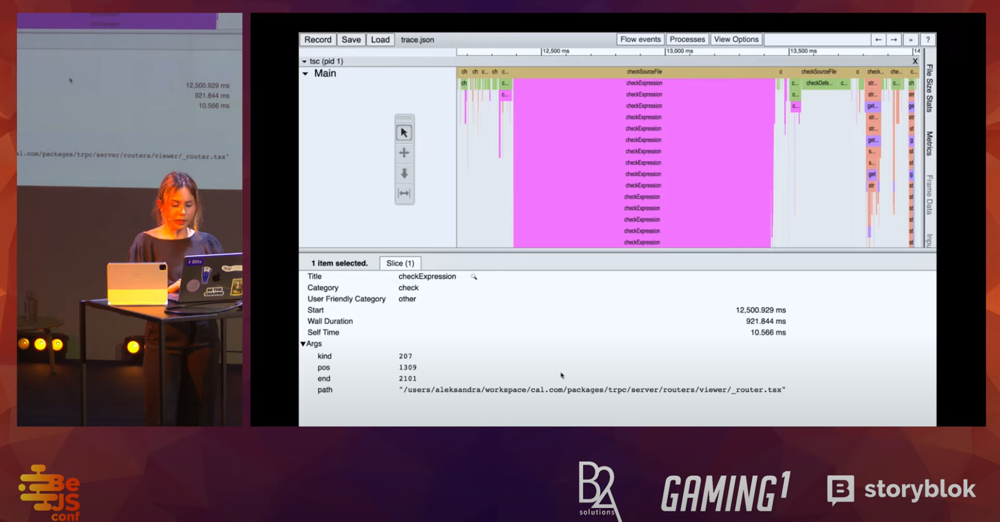

# Performance

This topic topic is quite new some developer discssion about TypeScript Performance and how to improve it.

Aleksandra Sikora - Typescript Performance: Going Beyond The Surface

## Performance Inspection Tools

[tsperf](https://tsperf.dev/) is open-source tools that help you visualise potential performance issues, detect regressions, decode compiler measurements and much more.

## Developer Discussion

Here is the list of developer discussion about TypeScript Performance:
- Aleksandra ([@aleksandrasays](https://x.com/aleksandrasays)) 